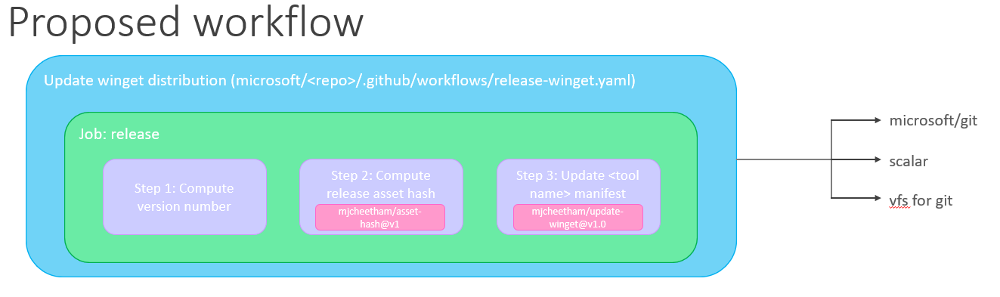

# Distributing Git scaling products for Windows

# Problem statement
The process for distributing Windows versions of Scalar, microsoft/git, Git Credential Manager Core, VFS for Git, and the Git telemetry service (referred to collectively as _Git scaling products_ in this document) for Office currently requires a fair amount of manual coordination. The GitHub Git Service team manually pushes releases to "fast" and "slow" rings after a back-and-forth email chain with the Office Developer Platform team. The goal of this document is to describe our transition from this process to an automated release/upgrade story facilitated by [winget](https://docs.microsoft.com/en-us/windows/package-manager/).

# Proposed architecture

## Current state
As depicted in the diagram below (and stated in the [Problem Statement](#problem-statement) above), the current Git scaling product distribution story for Office involves a lot of manual coordination. Additionally, it involves a special Azure release, which is separate from the GitHub releases that are also being produced for each product (excluding the Git Telemetry Service).

## Proposed future state
__Note:__ The above diagram is _Office-specific_ - it focuses on the GitHub Git Service team's process for distributing Git scaling products to Office. However, the below diagram is _Windows-specific_ - it should be considered the north star for anyone working on a Windows machine to consume Git scaling tooling.

The below shows where we'd like to land upon completing this project. As mentioned above, we plan to eliminate the current Azure DevOps release; we will instead update our tooling's manifests in the [microsoft/winget-pkgs repo](https://github.com/microsoft/winget-pkgs), leaning into winget's `install`/`upgrade` infrastructure. See [this page](https://docs.microsoft.com/en-us/windows/package-manager/package/) for more details on winget manifests.

__Note__: Because the Git Telemetry Service lives in Azure DevOps, it will not be deployed using the winget manifest strategy described above. Rather, it will be deployed as a standalone installer users can download and run.

## Proposed workflow for Scalar, microsoft/git, and VFS for Git

Scalar, microsoft/git, and VFS for Git will use the workflow pictured below to publish releases to winget.

Each repo will have a new YAML file at `microsoft/<repo>/.github/workflows/release-winget.yaml`. This file will contain one job, titled `release`, that runs on an agent running `ubuntu-latest`. This job will contain three steps:

1. Compute version number (using a custom script)
2. Compute asset hash (using the existing `mjcheetham/asset-hash` action)
3. Update the tool's winget manifest (using the existing `mjcheetham-update-winget` action)

# Project time estimate and breakdown
## _Total projected time for project - 4 weeks_

| General                                                                                                      |        |
|--------------------------------------------------------------------------------------------------------------|--------|
| Ramp on TypeScript/GitHub Actions                                                                            | 3 days |
| Solidify design/answer outstanding questions                                                                 | 1 day  |
 

| winget                                                                                                                              |        |
|-------------------------------------------------------------------------------------------------------------------------------------|--------|
| Add manifests for microsoft/git, scalar, and vfs for git to [microsoft/winget-pkgs](https://github.com/microsoft/winget-pkgs) repo  | 2 days |
 

| GitHub Actions                                                                                                                                                            |        |
|-------------------------------------------------------------------------------------------------------------------------------------------------------------------------------|--------|
| Update mjcheetham/asset-hash action to work with Windows exes                                                                                                                 | 2 days |
| Fix failing mjcheetham/update-winget action                                                                                                                                   | 2 days |
| Create winget distribution workflows for microsoft/git, scalar, and vfs for git (see [worflow proposal](#proposed-workflow-for-Scalar,-microsoft/git,-and-VFS-for-Git) above) | 3 days |
 

| Git Telemetry Service                                                                                                                               |        |
|-----------------------------------------------------------------------------------------------------------------------------------------------------|--------|
| Set up and deploy custom tools installer from [`GitInternalTelemetry`](https://dev.azure.com/mseng/AzureDevOps/_build?definitionId=6973) pipeline   | 1 day  |
 

| Testing                                                                                                      |        |
|--------------------------------------------------------------------------------------------------------------|--------|
| Create test repos, releases, and GitHub actions in personal account                                          | 1 day  |
| Validate new workflows in test repos                                                                         | 2 days |
 

| Documentation                                                                                                |        |
|--------------------------------------------------------------------------------------------------------------|--------|
| Update deployment documentation to reflect new state of the world                                            | 1 day  |
| Update Office documentation to reflect new state of the world                                                | 1 day  |
 

# Required permissions

* Edit pipeline permissions for [mseng/AzureDevOps](https://dev.azure.com/mseng/AzureDevOps) project

# Dependencies

The biggest dependency/potential blocker for this project is winget. While winget promises to be amazing tech one day, it is still in public preview and needs to be substantially modified before it offers feature parity with similar systems (like [Homebrew](https://brew.sh/) for macOS). 

To use winget, users currently must do one of the following:
* Install the flight or preview version of Windows App Installer, which involves gaining early access by [submitting a request to the Windows Package Manager Insiders Program](https://aka.ms/AppInstaller_InsiderProgram).
* Participate in the [Windows Insider flight ring](https://insider.windows.com/).
* Install the Windows Desktop App Installer package located on the [Releases page for the winget repository](https://github.com/microsoft/winget-cli/releases).

Additionally, the `winget upgrade` feature is currently considered experimental, meaning users must follow [a series of manual steps](https://github.com/microsoft/winget-cli/blob/master/doc/Settings.md#experimental-features) to enable it.

# Outstanding questions

* Where will the "custom tools installer" for the Telemetry Service live? How will users get it?
* Can I assume `gcm-core` is bundled with new microsoft/git releases?
* Is the new way really the north star? Do we expect the OS repo to onboard, for example?
* Is there documentation that will need to be updated? If so, where is it?
* Is making `scalar upgrade` work in-scope?
* Will winget notify users when new releases are available? How will we notify users when new versions of the telemetry service are available (since it will not be deployed to winget)?
* Do we have an admin contact for the mseng/AzureDevOps project I could reach out to about permissions?